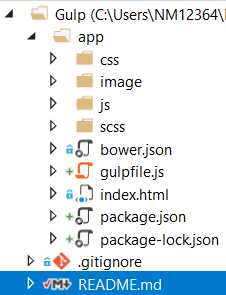

# Gulp
Gulp test projects

#### README.md
  - Dash + TAB for bullet points
  - Two spaces at the end of a line  
    for a new line
  - #+space for header tags
#### .gitignore
  - Default template : **Node**

  - **##Nupur's Custom Additions**  
    #Visual Studio 2015/2017 cache/options directory  
    .vs/
    #Node.js Tools for Visual Studio  
    .ntvs_analysis.dat  
    node_modules/  

#### Tutorial
  - Joel Longie
  - Gulp.js Build System #2 - Setup
  - https://www.youtube.com/watch?v=Oehs2H95a6E&list=PLv1YUP7gO_viROuRcGsDCNM-FUVgMYb_G&index=2

## Steps to Reproduce
### Step 1 - GIT
Create a GIT reository  
Use SourceTree to clone the remote GIT repository  
Use Visual Studio to open the folder and checkin changes

### Step 2 - Folder Structure
Create folder structure using command line commands
cd \Gulp
mkdir app
cd app
echo.>index.html

### Step 3 - Bower (Obsolete)
  - Does not work with corporate firewall. Connect to optimumwifi
  - Install Node -> npm -> bower
  - Check versions with -v
  - Inside app folder -> bower init -> default options
    - Creates bower.json
  - bower install jquery angular backbone --save
  - bower list --paths -> shows the path to use in the index.html file

### Step 4 - Gulp
  - npm init 
    - Creates package.json
  - npm install -g gulp
  - npm install gulp --save-dev
    - Creates package-lock.json
  - echo.>gulpfile.js in the root app folder  
 

###Tutorials
Introduction to Gulp JavaScript Task Runner - Step by Step Tutorial
Richard Barkinskiy
https://www.youtube.com/watch?v=1NzZg77VqdY
